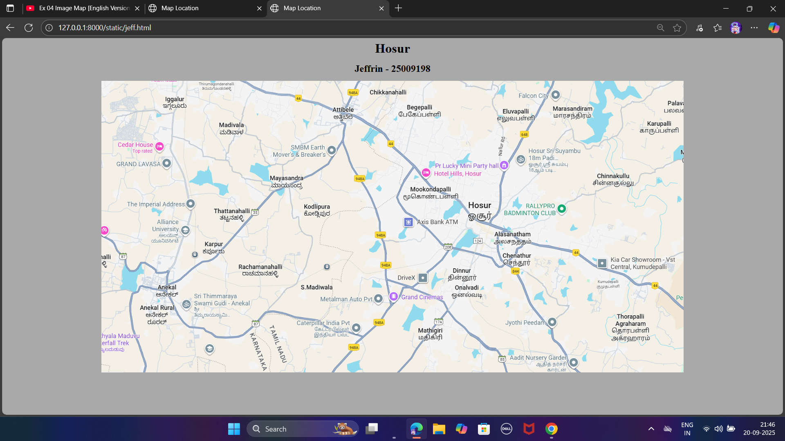
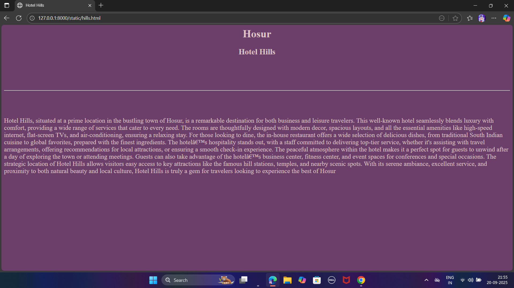
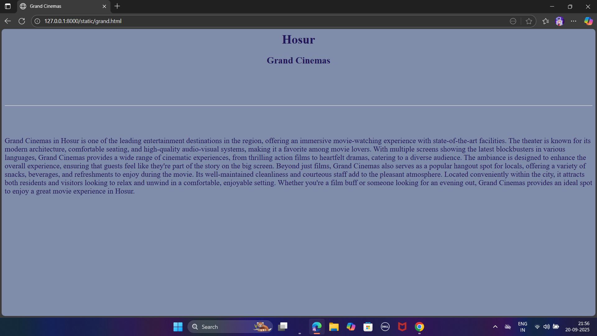
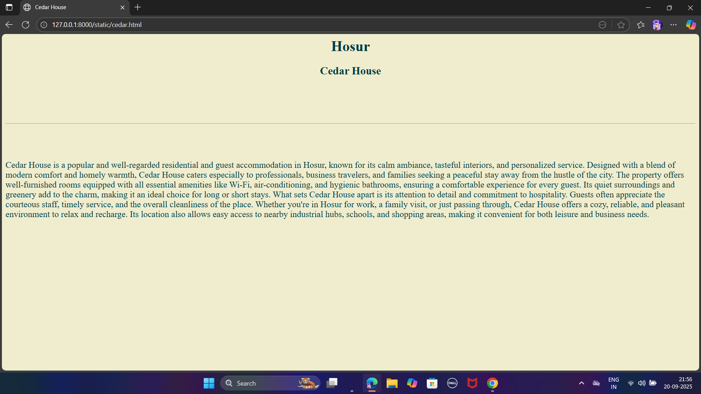
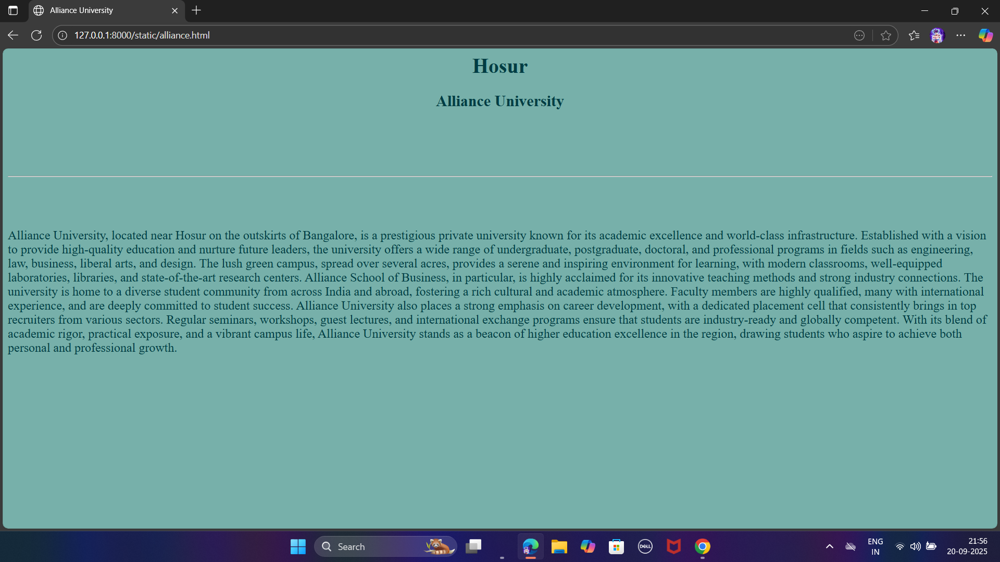
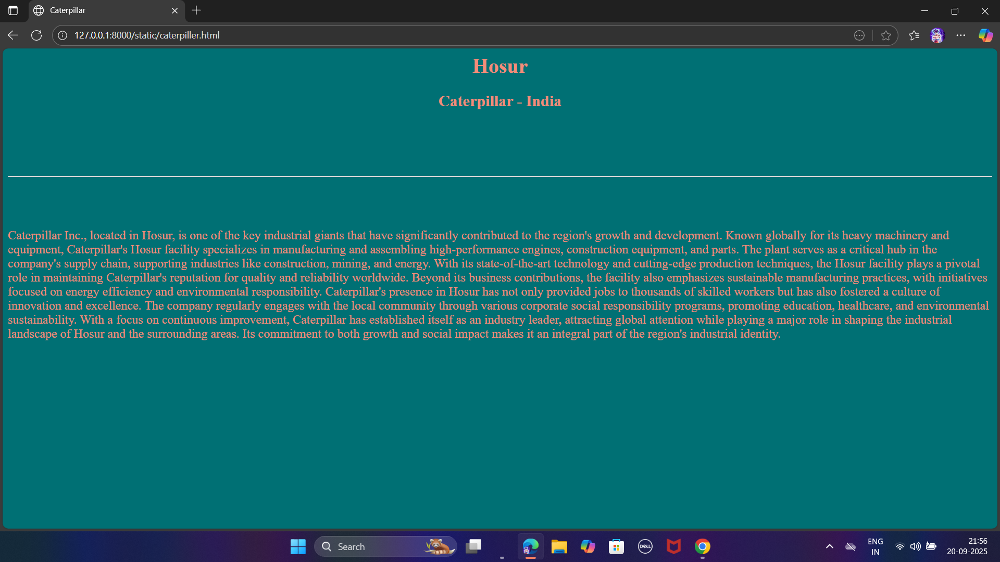

# Ex04 Places Around Me
## Date: 20.09.2025

## AIM
To develop a website to display details about the places around my house.

## DESIGN STEPS

### STEP 1
Create a Django admin interface.

### STEP 2
Download your city map from Google.

### STEP 3
Using ```<map>``` tag name the map.

### STEP 4
Create clickable regions in the image using ```<area>``` tag.

### STEP 5
Write HTML programs for all the regions identified.

### STEP 6
Execute the programs and publish them.

## CODE
```
jeff.html

<html>

<head>
    <title>Map Location</title>
</head>

<body style="background-color: darkgray;" style="color:darkslategray">
    <center>
    <h1><big>Hosur</big></h1>
    <h2><big>Jeffrin - 25009198</big></h2>
    

    <map name="image-map">
        <area target="" alt="Grand Cinemas" title="Grand Cinemas" href="grand.html" coords="838,611,1012,658"
            shape="rect">
        <area target="" alt="Cedar House" title="Cedar House" href="cedar.html" coords="47,169,187,214" shape="rect">
        <area target="" alt="Alliance University" title="Alliance University" href="alliance.html" coords="197,444,69"
            shape="circle">
        <area target="" alt="Hotel Hills" title="Hotel Hills" href="hills.html"
            coords="939,292,1146,291,933,288,1156,294,1119,257,1111,209,915,230,939,292" shape="poly">
        <area target="" alt="Caterpillar India" title="Caterpillar India" href="caterpiller.html"
            coords="558,694,770,768" shape="rect">
    </map>
    </center>
</body>

</html>

cedar.html

<html>

<head>
    <title>
        Cedar House
    </title>
</head>

<body style="color:#003C43" bgcolor="F0EDCF">
    <center>
        <center>
            <h1><b>Hosur</b></h1>
            <h2>Cedar House</h2>

            <br><br><br><br>
            <hr>
            <br><br><br>
            <p align="left"><big>
                    Cedar House is a popular and well-regarded residential and guest accommodation in Hosur, known for
                    its calm ambiance, tasteful interiors, and personalized service. Designed with a blend of modern
                    comfort and homely warmth, Cedar House caters especially to professionals, business travelers, and
                    families seeking a peaceful stay away from the hustle of the city. The property offers
                    well-furnished rooms equipped with all essential amenities like Wi-Fi, air-conditioning, and
                    hygienic bathrooms, ensuring a comfortable experience for every guest. Its quiet surroundings and
                    greenery add to the charm, making it an ideal choice for long or short stays.
                    What sets Cedar House apart is its attention to detail and commitment to hospitality. Guests often
                    appreciate the courteous staff, timely service, and the overall cleanliness of the place. Whether
                    you're in Hosur for work, a family visit, or just passing through, Cedar House offers a cozy,
                    reliable, and pleasant environment to relax and recharge. Its location also allows easy access to
                    nearby industrial hubs, schools, and shopping areas, making it convenient for both leisure and
                    business needs.
                </big></p>
        </center>
    </center>
</body>

</html>

hills.html

<html>

<head>
    <title>
        Hotel Hills
    </title>
</head>

<body bgcolor="6B3F69" style="color:#DDC3C3">
    <center>
        <h1><b>Hosur</b></h1>
        <h2>Hotel Hills</h2>

        <br><br><br><br>
        <hr>
        <br><br><br>


        <p align="left"><big>
                Hotel Hills, situated at a prime location in the bustling town of Hosur, is a remarkable destination for
                both business and leisure travelers. This well-known hotel seamlessly blends luxury with comfort,
                providing a wide range of services that cater to every need. The rooms are thoughtfully designed with
                modern decor, spacious layouts, and all the essential amenities like high-speed internet, flat-screen
                TVs, and air-conditioning, ensuring a relaxing stay. For those looking to dine, the in-house restaurant
                offers a wide selection of delicious dishes, from traditional South Indian cuisine to global favorites,
                prepared with the finest ingredients.
                The hotel’s hospitality stands out, with a staff committed to delivering top-tier service, whether it's
                assisting with travel arrangements, offering recommendations for local attractions, or ensuring a smooth
                check-in experience. The peaceful atmosphere within the hotel makes it a perfect spot for guests to
                unwind after a day of exploring the town or attending meetings. Guests can also take advantage of the
                hotel’s business center, fitness center, and event spaces for conferences and special occasions. The
                strategic location of Hotel Hills allows visitors easy access to key attractions like the famous hill
                stations, temples, and nearby scenic spots. With its serene ambiance, excellent service, and proximity
                to both natural beauty and local culture, Hotel Hills is truly a gem for travelers looking to experience
                the best of Hosur
            </big></p>
    </center>
</body>

</html>

grand.html

<html>

<head>
    <title>
        Grand Cinemas
    </title>
</head>

<body bgcolor="7F8CAA" style="color:201658">
    <center>
        <h1><b>Hosur</b></h1>
        <h2>Grand Cinemas</h2>

        <br><br><br><br>
        <hr>
        <br><br><br>


        <p align="left"><big>
                Grand Cinemas in Hosur is one of the leading entertainment destinations in the region, offering an
                immersive movie-watching experience with state-of-the-art facilities. The theater is known for its
                modern architecture, comfortable seating, and high-quality audio-visual systems, making it a favorite
                among movie lovers. With multiple screens showing the latest blockbusters in various languages, Grand
                Cinemas provides a wide range of cinematic experiences, from thrilling action films to heartfelt dramas,
                catering to a diverse audience. The ambiance is designed to enhance the overall experience, ensuring
                that guests feel like they're part of the story on the big screen.
                Beyond just films, Grand Cinemas also serves as a popular hangout spot for locals, offering a variety of
                snacks, beverages, and refreshments to enjoy during the movie. Its well-maintained cleanliness and
                courteous staff add to the pleasant atmosphere. Located conveniently within the city, it attracts both
                residents and visitors looking to relax and unwind in a comfortable, enjoyable setting. Whether you're a
                film buff or someone looking for an evening out, Grand Cinemas provides an ideal spot to enjoy a great
                movie experience in Hosur.
            </big></p>
    </center>
</body>

</html>

caterpiller.html

<html>

<head>
    <title>
        Caterpillar
    </title>
</head>

<body bgcolor="007074" style="color:F38C79">
    <center>
        <h1><b>Hosur</b></h1>
        <h2>Caterpillar - India</h2>

        <br><br><br><br>
        <hr>
        <br><br><br>


        <p align="left"><big>
                Caterpillar Inc., located in Hosur, is one of the key industrial giants that have significantly
                contributed to the region's growth and development. Known globally for its heavy machinery and
                equipment, Caterpillar's Hosur facility specializes in manufacturing and assembling high-performance
                engines, construction equipment, and parts. The plant serves as a critical hub in the company's supply
                chain, supporting industries like construction, mining, and energy. With its state-of-the-art technology
                and cutting-edge production techniques, the Hosur facility plays a pivotal role in maintaining
                Caterpillar's reputation for quality and reliability worldwide. Beyond its business contributions, the
                facility also emphasizes sustainable manufacturing practices, with initiatives focused on energy
                efficiency and environmental responsibility.
                Caterpillar's presence in Hosur has not only provided jobs to thousands of skilled workers but has also
                fostered a culture of innovation and excellence. The company regularly engages with the local community
                through various corporate social responsibility programs, promoting education, healthcare, and
                environmental sustainability. With a focus on continuous improvement, Caterpillar has established itself
                as an industry leader, attracting global attention while playing a major role in shaping the industrial
                landscape of Hosur and the surrounding areas. Its commitment to both growth and social impact makes it
                an integral part of the region's industrial identity.
            </big></p>
    </center>
</body>

</html>

alliance.html

<html>

<head>
    <title>
        Alliance University
    </title>
</head>

<body bgcolor="77B0AA" style="color:003C43">
    <center>
        <h1><b>Hosur</b></h1>
        <h2>Alliance University</h2>

        <br><br><br><br>
        <hr>
        <br><br><br>


        <p align="left"><big>
                Alliance University, located near Hosur on the outskirts of Bangalore, is a prestigious private
                university known for its academic excellence and world-class infrastructure. Established with a vision
                to provide high-quality education and nurture future leaders, the university offers a wide range of
                undergraduate, postgraduate, doctoral, and professional programs in fields such as engineering, law,
                business, liberal arts, and design. The lush green campus, spread over several acres, provides a serene
                and inspiring environment for learning, with modern classrooms, well-equipped laboratories, libraries,
                and state-of-the-art research centers. Alliance School of Business, in particular, is highly acclaimed
                for its innovative teaching methods and strong industry connections.
                The university is home to a diverse student community from across India and abroad, fostering a rich
                cultural and academic atmosphere. Faculty members are highly qualified, many with international
                experience, and are deeply committed to student success. Alliance University also places a strong
                emphasis on career development, with a dedicated placement cell that consistently brings in top
                recruiters from various sectors. Regular seminars, workshops, guest lectures, and international exchange
                programs ensure that students are industry-ready and globally competent. With its blend of academic
                rigor, practical exposure, and a vibrant campus life, Alliance University stands as a beacon of higher
                education excellence in the region, drawing students who aspire to achieve both personal and
                professional growth.
            </big></p>
    </center>
</body>

</html>

```


## OUTPUT







## RESULT
The program for implementing image maps using HTML is executed successfully.
